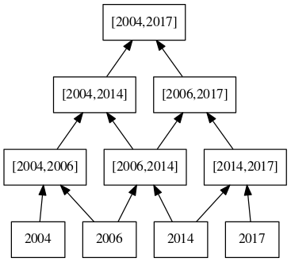
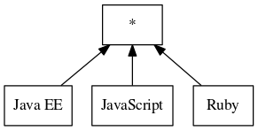
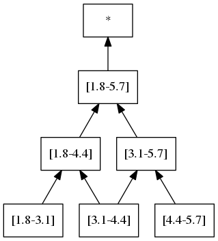

# Similarity Operator

## IntegerIntervalSimilarityOperator

This operator is defined for attribute values of type Integer.
It defines the similarity of two Integers _x_ and _y_ by the interval \[x,y\].

The similarity between two intervals \[a1,b1\] and \[a2,b2\] is defined by \[min(a1,a2),max(b1,b2)\].

For instance, the computed similarities for the values "2004", "2006", "2014" and "2017" are:

## StringDefaultSimilarityOperator

This operator is defined for attribute values of type String.
It defines that there is no similarity between two values (i.e., the similarity returned is *)

For instance, the computed similarities for the values "JavaScript", "Java EE" and "Ruby" are:

## DoubleIntervalSimilarityOperator

This operator is defined for attribute values of type Double.
First it computes the number of class intervals using the Sturgis formula.
Then it creates the corresponding class intervals.
The initial Double values are not kept in the set of similarities, only the computed intervals.

The similarity between two intervals \[a1,b1\] and \[a2,b2\] is defined by \[min(a1,a2),max(b1,b2)\].

For instance, the computed similarities for the values "1.8", "3.4" and "5.6" are:

 

For this set of values, the Sturgis formula gives 3 intervals with a range of 1.3.